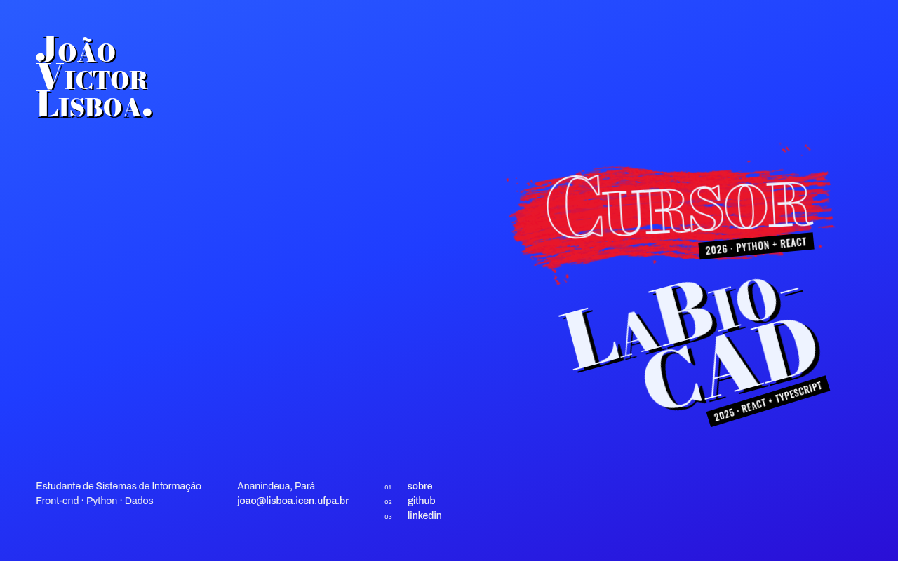

# Portfólio

**Meu portfólio pessoal.** Reúne meus projetos, minha formação e meus contatos em uma única página, feita só com HTML, CSS e JavaScript, sem frameworks e sem etapa de build.

**Acesse:** [joaovictor-rl.github.io/Portfolio](https://joaovictor-rl.github.io/Portfolio/)



**Tecnologias:** HTML · CSS · JavaScript · GitHub Pages

## Como funciona

A página inicial mostra os projetos como títulos grandes e inclinados. Ao passar o mouse, o título cresce, fica vazado e uma pincelada vermelha é "pintada" atrás dele.

Cada projeto, e também o "Sobre mim", é um `<dialog>` do próprio HTML. Um link com `data-abrir="id"` abre o painel com aquele `id`, e o botão de voltar, marcado com `data-fechar`, fecha. O painel se abre num círculo que cresce a partir do ponto clicado: o `script.js` guarda a posição do clique nas variáveis `--x` e `--y`, e o CSS anima um `clip-path` a partir dali.

Quem ativa a opção de reduzir movimento no sistema vê o site sem animações. No celular, a lista fica reta e a página rola normalmente.

## Estrutura

```
Portfolio/
├── index.html            todo o conteúdo: lista de projetos, nome, informações e painéis
├── assets/
│   ├── css/
│   │   ├── base.css      cores, fontes e regras gerais
│   │   ├── nome.css      nome (topo) e informações (rodapé)
│   │   ├── lista.css     lista de projetos, animação de entrada e pincelada
│   │   └── projetos.css  painéis que abrem por cima da página
│   ├── js/script.js      abre e fecha os painéis
│   └── img/              ícone, capturas dos projetos e a pincelada
└── docs/                 imagem usada neste README
```

## Segurança

O site não tem formulários, back-end nem guarda dados de visitantes. Uma política de segurança (`Content-Security-Policy`, no `<head>` do `index.html`) só permite carregar arquivos do próprio site e as fontes do Google Fonts, então nenhum script de fora consegue rodar na página. Os links externos abrem em outra aba com `rel="noopener noreferrer"`.

## Hospedagem

O site está no GitHub Pages, servido direto da branch `main`. Cada `git push` publica a nova versão em um ou dois minutos.

## Inspirações

O layout da página inicial, com os títulos grandes em perspectiva, veio do site do estúdio Van Holtz. A tipografia de capa de revista, as etiquetas pretas inclinadas e a pincelada vermelha vieram da estética dos jogos Metaphor: ReFantazio e Persona 5.

---

**João Victor R. Lisboa** · Sistemas de Informação, UFPA · [github.com/joaovictor-rl](https://github.com/joaovictor-rl)
